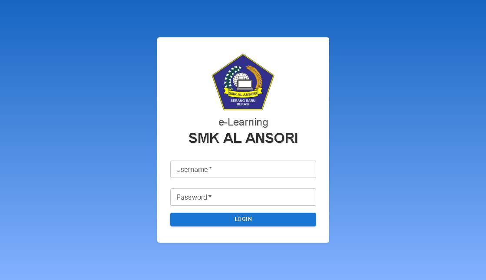
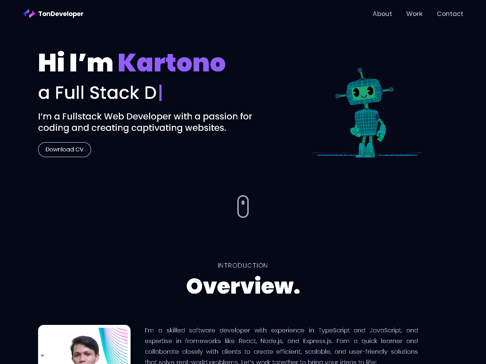
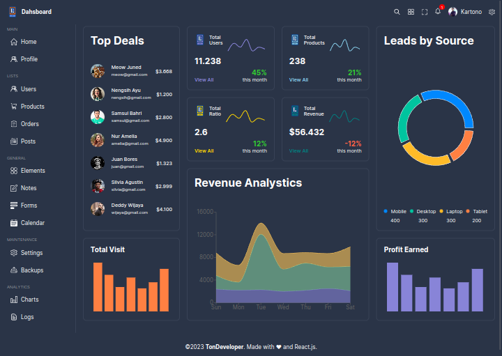

## Hi I'm Kartono 

🚀 I'm a Fullstack Web Developer with a focus on JavaScript and TypeScript. I specialize in creating captivating user interfaces using React on the frontend and harnessing the power of Express on the backend.

:mailbox: Reach me out!

 

### Top Technologies

### Demo Project

  
  
  
  

