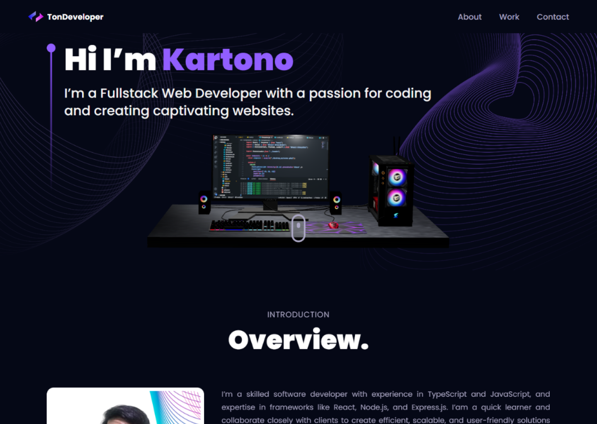

### About me

- 🚀 I'm a Fullstack Web Developer with a focus on JavaScript and TypeScript. I specialize in creating captivating user interfaces using React on the frontend and harnessing the power of Express on the backend.

- 🌟 As an open-source enthusiast, I greatly appreciate the collaborative efforts of the developer community in driving innovation and building amazing projects together.

- 🎯 I love challenges and find joy in turning ideas into reality through my coding skills. Let's create exceptional web experiences!

### Languages & Frameworks & Tools & Abilities

### Demo Project

  
  
  

